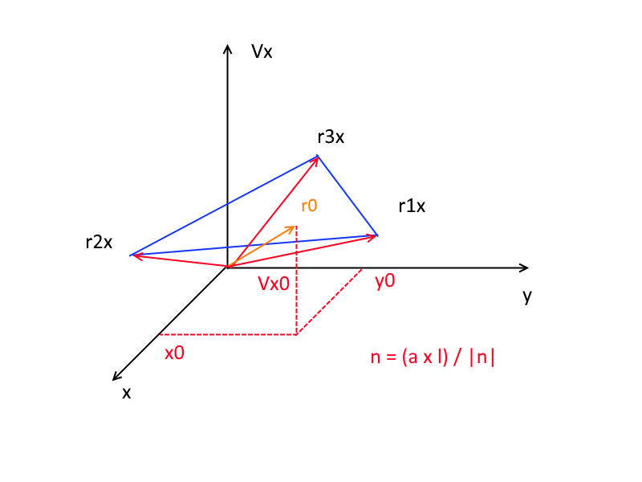
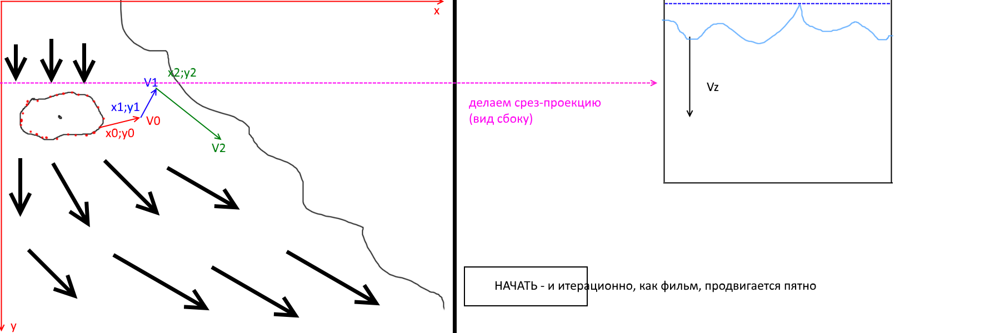

виды курсовой:
1. вихри
2. разлив и сбор нефтяного пятна
	- ГСЦ - рассчитать штат спасателей
	- какие брать лодки (большие/маленькие)
	- какое использовать топливо
	- сорбенты (какиех выбрасываються порошки, которые поглощают нефть (например что бы рыбки не ели нефть и в водоросли оно не впитывалось))
	- погода (как одеть людей/обмундирование)
	- сколько есть времени
	- какие затраты

Потренировать фантазию - написать игру для продумывания этих штук (игра по проекту курсовой)

	- ("делали КАЗАКИ на заводе Ростов, но до начала писали на квартире (прим. ред. - вместе с САМИМ ГРИГИРОВИЧЕМ)")

	какая-то странная тема про прокачку в "казаках" - то чего не было на релизе

	рекорд по подъему беспилотником веса - 16кг

продолжение решения задачи:

каждую точку пятна сместить на вектор V

	x1 = x0 + t*Vx
	y1 = y0 + t*Vy

1. Поиск трех ближайших векторов из БД (x;y)

	d = sqrt((x2-x1)^2 +(y2-y1)^2)
	d = sqrt((x-x)^2 +(y-y)^2)
	d = sqrt((x-x)^2 +(y-y)^2)

2. Три ближайших вектора запишем как радиус вектора
	
	r1 (x1;y1;Vx1;Vy1)
	r2 (x2;y2;Vx2;Vy2)
	r3 (x3;y3;Vx3;Vy3)

3. r0 (x0;y0;Vx0;Vy0)

Создаем плоскость из X, Y, Vx (интерполяционная плоскость)

1. через три точки можно провести плоскость r1(x1,y1,Vx1,Vy1), r2(x2,y2,Vx2,Vy2), r3(x3,y3,Vx3,Vy3)
2. с другой стороны плоскость можно провести из точки и нормали. Найдем нормаль, перемножив вектно два вектора (r2-r1) i (r2-r3), поделив на длину нормали - получим единичную нормаль

	r1x, r2x, r3x, r1y, r2y, r3y - вектора

	Vx0 = |((r2x-r1x)/|(r2x-r1x)|) x ((r2x-r3x)/|(r2x-r3x)|)| = n(nx,ny,nz) = 1
	Vy0 = |((r2y-r1y)/|(r2y-r1y)|) x ((r2y-r3y)/|(r2y-r3y)|)| = m(mx,my,mz) = 1

Найдем уравнение плоскости, которое проходит через вектор (r0x-r1x), где вектор r0x перпендикулярен нормали

Исходя из того, что скалярное произведение двух перпендикулярных векторов равняется нулю, можем записать уравнение.

Для Vx0: 

	(r0x - r1x) * n = 0

Распишем

	(x0 - x1) * nx + (y0 - y1) * ny + (Vx0 - Vx1) * nz = 0

Для Vy0: 

	(r0y - r1y) * m = 0

Распишем

	(x0 - x1) * mx + (y0 - y1) * my + (Vx0 - Vx1) * mz = 0

Находим Vx0 i Vy0:

	Vx0 = (1/nz)*(-(x0-x1)*nx - (y0-y1)*ny)+Vx1

	Vy0 = (1/nz)*(-(x0-x1)*nx - (y0-y1)*ny)+Vy1

Таким образом, мы нашли r0 в точке пятна загрязнения r0(x0;y0;V0x;V0y;)

Расчет конечного (текущего) положения точки (х0:у0) вконце первого интервала времени delta t = 1 сек.

	Xновое = Х0 + Vx0 * t

	Yновое = Y0 + Vy0 * t

И далее возврат в начало алгоритма: поиск трех ближайших векторов относительно Хновое Yновое.

задаем пятно по синусу-косинусу (круг или елипс)

задачу можно рассчитать сложнее - сделать срез в любой части пятна и посмотреть насколько глубоко оно может проседать в воду (со скоростью Vz, в зависимости от % частиц, которые оседают в воду) ("не для всех, только у кого есть воображение")
