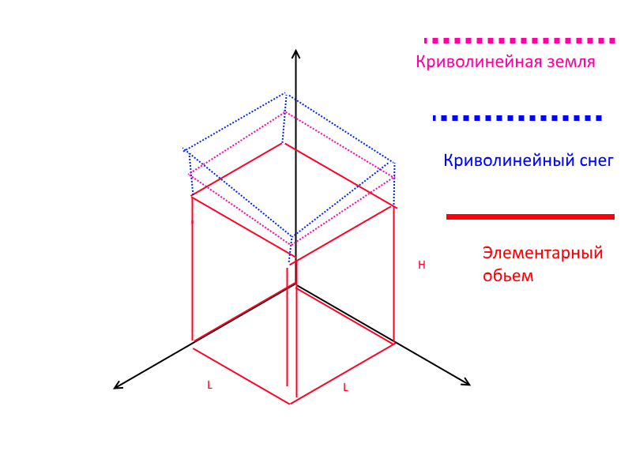
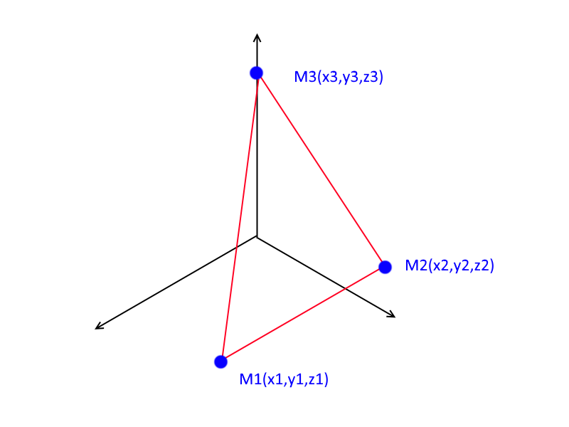
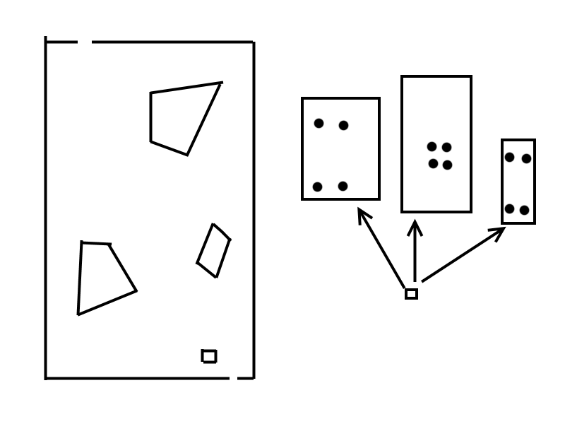
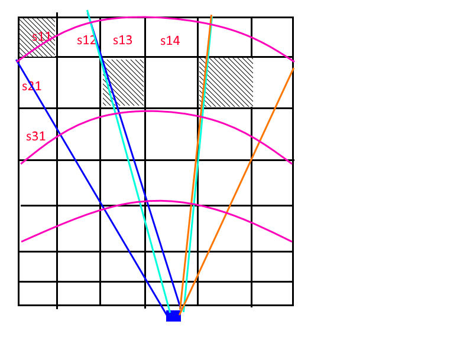

Обследвание снегозапаса в горах с помощью БПЛА (UAV) (вроде бы лаба №3)

Рисуем такие штуки:
1. 3д
2. Вид сверху + накладываем сетку с шагом L (так же добавляем линии высот и линии снега (снег пунктиром))
3. Вид сбоку/срез горы (линии высот + снег)

для просчета вычитаем елементарный обьем, криволинейную плоскость сверху делим пополам на два треугольника - (быстро говорила, не успел записать)

элементарный обьем - берем один кусочек с карты 2 (квадрат) в изометрии. Его основание это L * L. Сверху надстройка, которую надо посчитать. Высота кусочка H (высота линии высот в той местности).

Для определения снегозапаса для каждого узла сетки найдем координаты x,y, z_c, z_r.

Для нахождения координаты икс и игрек - берем координаты сетки из карты 2.

Z_c - высота узла сетки относительно линий равных высот со снегом

Z_r - высота узла сетки относительно линий равных высот без снега

для установления третьей координаты (z_c и z_r) нужно установить к каким двум линиям равных высот ближе всего находится данный узел сетки и высчитать собственную высоту узла по формуле:

	H = (H1+H2)/2 + (R1-R2)/(R1+R2) * (H2 - H1)/2,
	где H - высота данного узла сетки
	H1 i H2 - значения высот линий, которые находятся ближе к узлу которые мы имеем.
	R1 и R2 - расстояния до этих линий высот.

	- ("На мониторе карта и мышкой выделяем прямоугольной зоны (нажали и запомнили х и у экрана).")

	- ("Выбираем узлы, которые попали в выделенный прямоугольник.")

Для рассчета обьема снегозапаса одного элементарного обьема используем формулу:

	Vi = ( L*L*(3*(z3-z1)*(z2-z1)-(z2-z1)^2 + (z3-z2)) )/(6)   (???)

	где координата Zi (i=1,2,3) при расчете обьема рельефа со снегом являет собой координаты Z_Ci (z_c1,z_c2,z_c3).

	где координата Zi (i=1,2,3) при расчете обьема рельефа без снега являет собой координаты Z_Ri (z_r1,z_r2,z_r3).

Обьем снегозапаса всей зоны:

	Vснегозапаса = Summa(Vi_s_r) - Summa(Vi_r)

Еще одна задача - роботы для разведки радиоционно-зараженый помещений.

"Дистанционное обследование радиоционно зараженного помещения и построение карты разрушенного помещения с помощью мобильного интеллектуализированного робота" (лаба 4???)

	- ("Мой дед приходит крепкой силы занимался ядерной физики. Зашел в реактор и его все быстро съело. Потому что эта штука ломает энергетику")

	- ("ядерщики зомби и берут энергию с соседних людей.")

	- ("Когда вот едишь туда чувствуешь что тебя за голову берет")

	- ("Сначала контролируешь а потом тебя берут под контроль")

	- ("АЕС в Иране")

	- ("Ракеты")

	- ("Поехали на дальний восток мыс Шульц тихий океан чистая природа вода голубая нет ниодного человека")

	- ("Донец Днепропетровск история про Львов. Гриша про бензин 95 до полного(налил дт)")

Есть комната, известно было что по плану А х Б, и что были входы/выходы/колонны. Заезжает робот и у него 4х лазерная навигация. Роботу надо построить план и радиацию измерить.

Четырех-лазерная навигация

Одна камера сверху на -60 - +60 градусов.

Робот знает свои габариты и размеры колеса. На основе этих принципов, он проехал, построил три картинки.

Есть еще одна задача: определение наиболее радиационно-заражнных мест (походу к той же лабе)

детектируем в каждой ячейке излучение 5 раз и строим матрицу (если там 7 х 4 ячейки, то 28 х 5 матрица).

	1 2 3 4 5 6 7
	S11 S12 S13 S14 S15 S21 S22 S23 S24 S25...
	     *           *
	     1/4         1/8

	ставим звездочку, где было детектирование частиц

	ставим какую часть площади ячейки детектировало

	Делаем второй замер

	1 2 3 4 5 6 7
	S11 S12 S13 S14 S15 S21 S22 S23 S24 S25...
	     *           *
	     1/4         1/8
	     *            *
	     3/4         8/9

	Делаем СЛАУ из этих попаданий

	N1 * 0 * * * 0 0 0 
	N2 0 0 0 * * 0 0 0
	N3 0 0 0 * * * 0 0
	N4 ...

В конце будет большая формула где надо знать:
- размер окна (B * C) свинцовой оболочки счетчика частиц
- время Тау - время экспозиции, за которое он получает N частиц (время берем каждый раз одинаковое)
- В звездочке на самом деле куча слагаемых